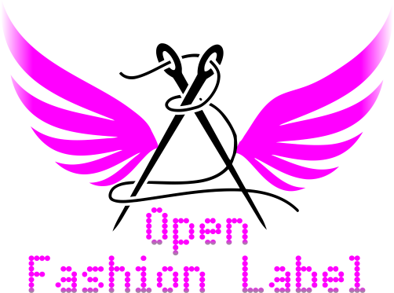

# OpenFashionLabel

OpenFashionLabel is an open source bespoke virtual fashion label using AI machine learning and CGI/VFX. The fashion designs will be freely redistributable under the Creative Commons Attribution-NonCommercial-NoDerivatives 4.0 International (CC BY-NC-ND 4.0).
